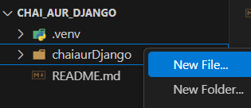
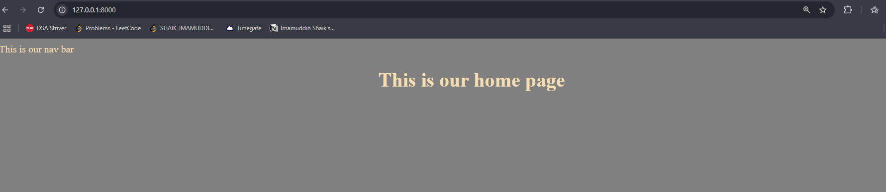
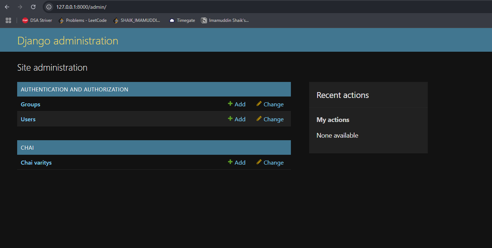
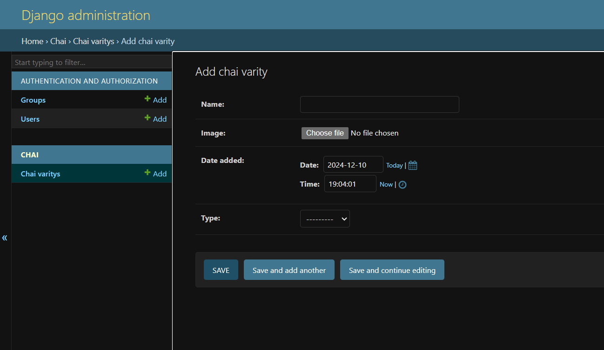

# Django Framework Setup
This is a beginner friendly guide to how to start building apps using django.

In python, we always create a virtual environment to isolate the dependencies and also have a local environment for easy build and deployment

### Old way of creating Virtual environment
    python -m venv .venv

### uv is exptereamly fast package manager written in rust
### Install the uv using pip
     pip install uv

### Creates a new virtual environment using uv at .venv
    uv venv

# Setting Execution Policy
### Set Execution Policy for Current User: Applies the RemoteSigned policy to your user account only.
     Set-ExecutionPolicy RemoteSigned -Scope CurrentUser

### This will initilize the virtual environment
     .venv/Scripts/activate

### Install Django using uv
     uv pip install Django

### Start Django Projeect
    django-admin startproject chaiaurDjango

### Go to Project folder
    cd chaiaurDjango

### Run the app using manage.py and runserver
    python manage.py runserver

### Now the server will be running at port 8000
    Check out the app - http://127.0.0.1:8000/

### If you want to run on specific port. Ex- port - 8001
    python manage.py runserver 8001

## File Exploration

### manage.py
This file is the starting point for the app. This file sets the environment varialbles and many other
-> What it does: The main command-line tool for interacting with your project.
-> What you can do:

    -> Run your development server:         python manage.py runserver
    -> Apply database migrations:           python manage.py migrate
    -> Create a new app:                    python manage.py startapp appname

You’ll use this file a lot during development.

### settings.py
What it does: The most important file for your project settings.
What it contains:
    -> Database configurations (SQLite is the default).
    -> Installed apps (like Django admin, authentication, etc.).
    -> Middleware (handles requests and responses).

When to use: Modify this file to set up your database, installed apps, and project-specific settings.

### urls.py

What it does: Manages the URL routing for your application.
What it contains:
    -> Links URLs to specific views or functionality.
    -> When to use: Add new paths here to handle different parts of your website.

### db.sqlite3
What it is: The default database for your project (SQLite).
Why it's used: It stores your application's data (like user accounts, blog posts, etc.).
When to use: SQLite is great for small projects or learning. For larger projects, you might switch to PostgreSQL or MySQL.

### Summary of Key Files:
    settings.py: Configure your project (apps, database, etc.).
    urls.py: Map URLs to views (webpages).
    manage.py: Command-line tool for running the server and managing the project.
    db.sqlite3: Your database.
As a beginner, focus on settings.py, urls.py, and manage.py as they are the most crucial for understanding Django projects.

### Creating basic views and urls
-----------------------------------------------------------------
|    User -> req -> urls -> views    (<- responses back)        |
-----------------------------------------------------------------

### Create view.py in the folder where urls.py is

-> Write the logic code.
-> views are similar to controllers in JavaScript where all the logic is written
-> create three functions/methods. home, about, contact. Return some text

### urls.py 
-> This works as router
-> Now write the code for different paths
-> Name the paths - home, about, contact and route them to the functions/methods in views file

    Ex- path('about/', views.about, name='about')

            views.about  - is the routing
            'about/'     - is the url when this is hit it will return the logic of that funciton/method 

## Templates and Static in Django

    On the root folder create a folder called 'templates'        -   Stores HTML files

    Create another fodler called 'static'                        -   Stores CSS, JavaScript files

 
### Templates
-> Inside create a file 'index.html'

### How to show index.html on root url ?
-> To do this we have to render the tempalte
-> go to views.py - modify the code
    
      from django.shortcuts import render
      return render(request, 'index.html')

### Set the views to render on views in setting
-> The home page above will not render because in the settings the templates folder is not defined in directories
-> go to settings.py 
-> check for 'TEMPLATES' array

            in              ->  'DIRS': [],
            change it to    ->  'DIRS': ['templates'],

-> Now if you want to make new folder website and place the index.html in that folder then you can do it.
-> But you have to modify it in the views -> return render(request, 'website/index.html')

### How to show CSS and JavaScript in Django
-> In Static create a file 'style.css'
-> Now to link css to index.html we need to do 'templating engine' 

-> In index.html

            
            <link rel="stylesheet" href="">

-> In settings.py
-> go to static url

        import os
        go to       - STATIC_URL

        Add this below code:

        STATICFILES_DIRS = [os.path.join(BASE_DIR, 'static)]

-> Now you can see the css working

## Creating apps in Django
-> python manage.py startapp <App Name> 
    Ex- python manage.py startapp chai

After this 

Step-1
-------
-> The project is not aware of this newly created app
-> We need to make the main project aware of this new app

-> go to settings.py file
-> search for 'INSTALLED_APPS'

    add this -> 'chai',

step-2
-------
-> Now evey app is a stand alone app. So we can create the templates in this apps as well and then export them when needed to have modlularity
-> in folder 'chai' -> create a new folder 'tempaltes'

-> Industry standard
-> you create a sub folder in templates with the same name as app name (i.e. chai)
-> And in that you create the html 

-> There is bug here. Because of django configuration we will not have access to emmet in this folder. so we need to explicitly tell that there are html files in this folder
-> To do that. follow step below
-> Press ctrl + , 
-> you will go to settings
-> search for 'emmet: include language'
-> Add Item -> django-html and in value - html

-> This will make sure we get the emmet suggestions for html but still this will be a django template

step-3
-------
-> Now the same thing go to views and define the methods/functions
-> After that we need to route this into url but we don't have any url in this app folders

-> We have to create urls in our each app
-> best practice is to copy the project urls which is the main one and paste the same in this app

-> But there is one main thing to do here is to pass the control to this sub-urls from the main urls
-> Go to the main project urls.py (which is chaiaurDjango/urls.py)

        from django.urls import path, include

        urlpatterns = [
                            path('chai/', include('chai.urls')),
                      ]

-> Now go to the chai/urls.py

        urlpatterns = [
                            path('', views.all_chai, name='home'),
                      ]

-> Now run the project and hit the http://127.0.0.1:8000/chai url and see the output

-> Now like this you can create as many apps as you want

### Now how can we apply css and JavaScript to this new app called chai
-> Lets create a tempalting 
-> go to the main /tempalte
-> create a file inside it called 'layout.html'
-> This layout file will be the base template for all the html files.
-> Now erase all the code in 'index.html'
-> After that we will define the layout as template in index.html

Layout.html

    

    <!DOCTYPE html>
    <html lang="en">
    <head>
        <meta charset="UTF-8">
        <meta name="viewport" content="width=device-width, initial-scale=1.0">
        <title>
            
            Default Value
            
        </title>
        <link rel="stylesheet" href="">
    </head>
    <body>
        <nav>This is our nav bar</nav>
        
        
        
    </body>
    </html>

index.html

    

    
        Home Page
    

    
        <h1>This is our home page</h1>
    

-> You will be able to see the Nav bar and home page

 Now you can do the same for the all_chai.html

all_chai.html

    

    
        Chai Page
    

    
        <h1>All the chais available here</h1>
    

## How to include Tailwind CSS in Django
-> Useful link - https://django-tailwind.readthedocs.io/en/latest/installation.html

Install tailwind
    python -m pip install django-tailwind

Reload the Django-Tailwind
    python -m pip install 'django-tailwind[reload]'

Add 'tailwind' to INSTALLED_APPS in settings.py:

    INSTALLED_APPS = [
    # other Django apps
    'tailwind',
    ]

Initialize the tailwind
    python manage.py tailwind init

Add your newly created 'theme' app to INSTALLED_APPS in settings.py:

    INSTALLED_APPS = [
    # other Django apps
    'tailwind',
    'theme'
    ]

Register the generated 'theme' app by adding the following line to settings.py file:

    TAILWIND_APP_NAME = 'theme'

Install Tailwind CSS dependencies, by running the following command:
    python manage.py tailwind install

Now in the theme/templates you will have a file 'base.html'

From that file copy
    
    

Paste it in the layout.html file.

Now you need to start another terminal for Tailwind CSS to work

-> Start a new terminal and get into venv, and get to the manage.py file location

    python manage.py tailwind start

You need to restart the python server to make this working.

And also add the NPM bin path to the settings.py - to make the tailwind run using node

    NPM_BIN_PATH = "C:/Program Files/nodejs/npm.cmd"

### Making hot re-loading accessable
-> Go to chaiaurDjango/settings.py
-> In INSTALLED_APPS - add
    'django_browser_reload',

-> In MIDDLEWARE - add
    "django_browser_reload.middleware.BrowserReloadMiddleware"

-> Go to urls.py - add
    path("__reload__/", include("django_browser_reload.urls")),

Now restart everything

These commands are to be run in seperate terminals:

    python manage.py runserver

    python manage.py tailwind start

### Migrations

-> In Django, we never talk to SQL directly. Instead Django ORM talks with the SQL
-> There are two commands for this
    python manage.py migrate

Now the databases are migrated - which means the tables are created in the database

### Creating a super user
-> Wriote this command in terminal
    python manage.py createsuperuser

-> create a user with password
-> after tha start server and go to admin/ and login with the credentials

## Handling Models and urls in Django
-> The models are only in apps and never in Project
-> Now we will study about how these models.py and admin.py routings happen

-> For database we can directly write the models in models.py

-> If you go to chaiaurDjango/settings. py and look for DATABASES. 
-> You will see the Engine. we can change these engines to postgre, mySql
-> we never need to change the code to change the database we just need to change the configuration in the settings.py
-> check out for guide here - https://docs.chaicode.com/django-models/

-> Go to chai/model.py
 add the code

-> Install pillow
    python -m pip install Pillow

-> Now to let settings.py know that we will be uploading the images
-> Go to settings.py - add code

    MEDIA_URL = '/media/'
    MEDIA_ROOT =  os.path.join(BASE_DIR, 'media')

-> Now we need to tell urls as well for this thing
-> Go to urls.py

    from django.conf import settings
    from django.conf.urls.static import static 

-> In this above code we are telling the static method that in the settings.py MEDIA_URL and ROOT to get it loaded.
-> Again in urls.py - add code

        url_patterns = [ ] + static(settings.MEDIA_URL, document_root=settings.MEDIA_ROOT)

-> This aboove is what connects the statics with settings.py

-> Actually, the Django project is not aware of this newly created model
-> To informt that we have to perform the below step

    python manage.py makemigrations

-> You will see a new folder and in it you will see a  folder migrations and a file in it called '0001_initial' 
-> if you see in that it is notting but sql queries

-> Now we can migrate this model to SQL by using below command
    python manage.py migrate

### Use of admin.py in (chai/)
-> Now you can attach any model to admin.py and see it in the admin
-> Lets do that now
-> go to admin.py - add the model to this admin using below code

    from .models import ChaiVarity

    # Register your models here.
    admin.site.register(ChaiVarity)

-> Reload the server and see the admin page

In the image above you can see that Chai Varity method is added to the admin with just 2 lines of code
When you click on add you will be able to add the data directly to sql. see below image for reference

## Taking the database data to frontend and showing them
-> Now we will try to list all the chai varity data in the all_Chai.html (frontend)
-> Go to chai/views.py

    from .models import ChaiVarity

    # Create your views here.
    def all_chai(request):
    chais = ChaiVarity.objects.all()
    return render(request, 'chai/all_chai.html', {'chais': chais})

-> Now go to templates/all_chai.html

    

    <h1>All the chais available here</h1>

    

        

            
        

    
    

    

-> Now lets add some Tailwind CSS
-> Add new terminal - and start the tailwind
    
        python manage.py tailwind start

## Adding one more data field - Description and price
-> In model.py

    description = models.TextField(default="")
    price = models.FloatField()

-> Noe because we made changes in model - we need to migrate the new model to database

    python manage.py makemigrations

    python manage.py migrate

    python manage.py runserver

### Click on the link and see the details of page
-> first of all we need to map the link to the repective chai details to show
-> go to chai/all_chai.html

`all_chai.html`

        <a href="">
            <button
            type="button"
            width="100%"
            class="inline-flex items-center justify-center w-[100%] px-4 py-2 border border-transparent text-sm font-medium rounded-md text-white bg-orange-600
            hover:bg-orange-700
            focus:outline-none focus:ring-2 focus:ring-offset-2 focus:ring-orage-500"
            >
                {{chai.type}} -{{chai.id}}
            </button>
        </a>

-> To perform this we need to create a new view for this
-> Go to views.py in chai/

    from .models import ChaiVarity

    from django.shortcuts import get_object_or_404

    def chai_details(request, chai_id):
    chai = get_object_or_404(ChaiVarity, pk=chai_id)
    return render(request, 'chai/chai_details.html', {'chai': chai})

-> Now go to chai/urls.py

    from django.urls import path
    from . import views

    urlpatterns = [
                    path('<int:chai_id>/', views.chai_details, name='chai_details'),
                  ]

-> Now after that go to `chai/templates/chai/chai_details.html`

`chai_details.html`

            

            
                Chai Detais Page
            

            

            <h2>Chai Details: </h2>
                <h3>{{chai.name}}</h3>
                <h3>{{chai.description}}</h3>
                <h3>{{chai.price}}</h3>

            

-> Now you were able to show up the data from the database to the frontend

-> Run the server again

        python manage.py runserver

-> Add new terminal - and start the tailwind
    
        python manage.py tailwind start